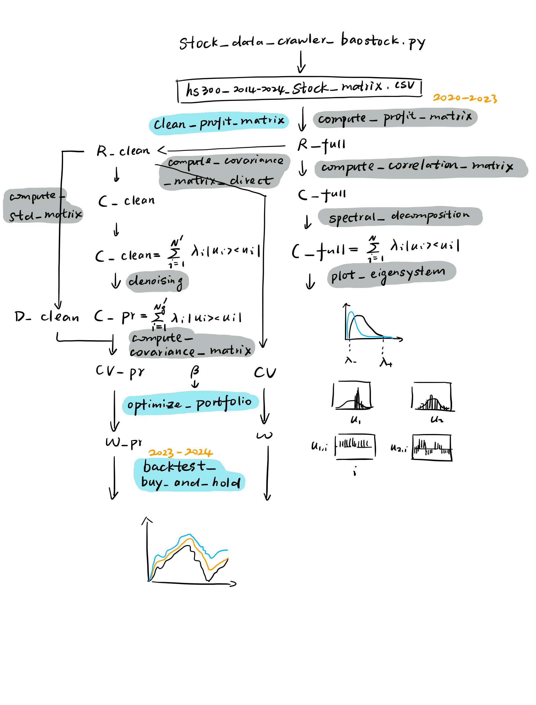

# Covariance-FundConstructor

基于大A个股股价关联/协方差矩阵构造的指数增强基金

目前我们从沪深300指数成分股中精选40支优质股票，得到其关联/协方差矩阵，并与随机矩阵做对比，分析其主成分。在基金beta因子应等于1的约束条件下，通过拉格朗日乘子法优化权重，最终得到了两种稳定超越沪深300的投资组合。

爬虫程序:
> crawler

股票日线数据：
> stock_matrix

函数包：
> corrkit.py

主函数及结果图：

（a）分析关联矩阵的本征信息（数据采集日期：2020-10-1～2023-10-1）

> eigensystem_main.py
>
> eigenvalues.pdf
>
> eigenvectors.pdf

（b）选股以及优化基金（回测日期：2023-10-2~2024-10-1）

> fund_main.py
> 
> pareto_mu_sigma.pdf
>
> backtest_fund_vs_hs300.pdf

## 技术路线

## 特别鸣谢

**GPT-5** ｜ 在代码编写上做出卓越贡献

**Baostock** ｜ 快速稳定的股票数据下载

## 参考文献

Plerou, V., Gopikrishnan, P., Rosenow, B., Amaral, L.A.N., Guhr, T. and Stanley, H.E., Random matrix approach to cross correlations in financial data. Phys. Rev. E, 2002, 65, 066126.